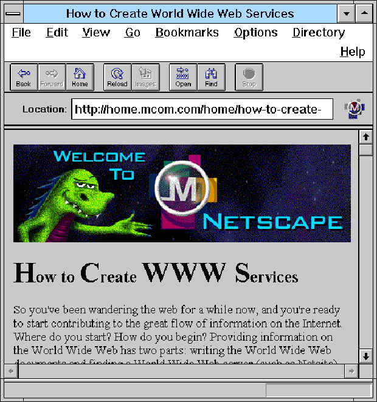

*"JavaScript is the duct tape of the Internet."*

I do not think I am overstating when I say that JavaScript is the most famous programming language in the world. Perhaps because JavaScript has been around since the beginning of the internet, that is, ever since personal computers became easily accessible and internet browsers, such as Netscape, became widely popular.  A lot of people who have never done any programming may simply know the word "JavaScript" due to it being extensively used on the Internet. And perhaps they may know that it has something to do with websites. I was one of those people before I learned any programming languages. The first time I heard the world "JavaScript" was when I disabled JavaScript on my browser after reading somewhere that it will increase the security of my computer. It turned out to be a horrible experience as the overall presentation of every website that I visited became out of order; some websites were impossible to navigate and some did not even allow me to use their website without  the JavaScript enabled. Initially, I did not have a good impression of JavaScript having read that it may pose security risks if enabled on browsers, however, this experience allowed me to realized that the Internet is practically nonfunctional without JavaScript.

## Learning experience

I started programming because I was always interested in starting a business of my own, and developing softwares were something that did not require a lot of money or put me in a financial risk. I taught myself how to develop iOS application in Objective-C by watching online videos and researching blogs. After having my iOS applications successfully deployed, I decided to further improve my programming skills by learning how to build websites. I purchased a book called *Web Design with HTML, CSS, JavaScript and JQuery Set* by Jon Duckett, which taught basics in JavaScript. I was at first intimidated by the syntax of JavaScript, mostly because I had spend months programming in Objective-C and anything other than Objective-C just seemed like a foreign language. However, what I found astonishing about JavaScript was that it allowed initializing different data types with a single keyword like “var,” “let,” or “const,” whereas in Objective-C, each data type had their own keyword, like “int,” “NSString,” and “bool” for integers, strings, and booleans, respectively. I personally prefer JavaScript’s syntax simply because it it a lot easier to memorize and the code looks a lot more organized. 

## Powerful tools
Through the book I was also able to learn how to use jQuery, a JavaScript library. jQuery allowed me add animations on websites with only a few lines of code. Through this, I learned that one of the advantages of using JavaScript is that there are countless frameworks and libraries that will make programming a lot easier and more powerful, especially because JavaScript is so widely adopted. There are other frameworks  that I came across around this time that I was interested in called p5.js which assists in making generative artworks with JavaScript. Although I did not learn how to use p5.js, it was exciting to see artists make stunning digital artworks using JavaScript.

It is undeniable that JavaScript is an essential programming language in modern technology, particularly the Internet. Due to above reasons, I feel comfortable in mastering JavaScript as one of my primary programming languages for software engineering.
