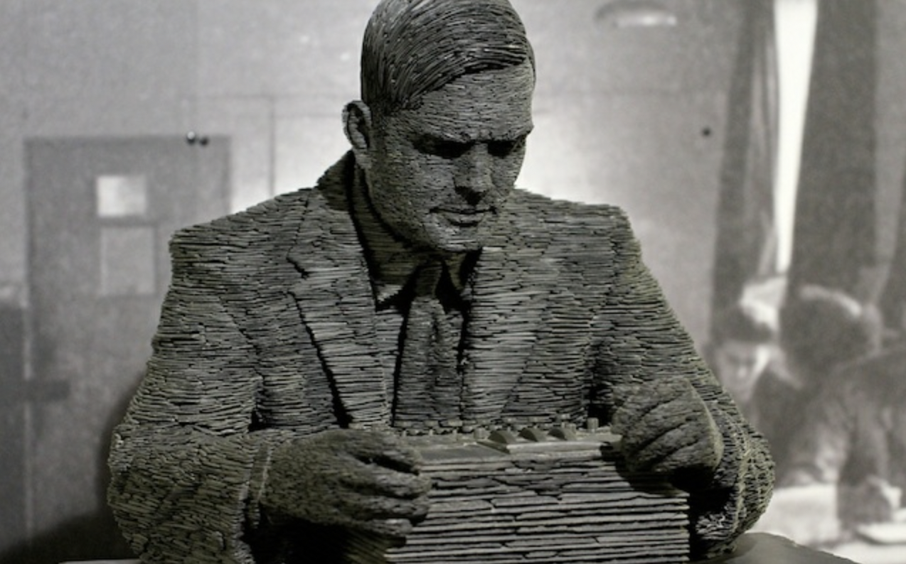

Vincent van Gogh, Claude Monet, Bob Dylan, and John Lennon, those were the kind of people that I looked up to growing up (and still do). Having parents who had both studied art, I was always interested in arts and music, and never considered myself as an academic person. After graduating from high school, I did not have a career path that I had chosen, nor did I see the benefit of going to school or importance of education; I naively thought that people are only in college because their parents told them to go to college, or because they had nothing else to do. I became disinterested in the idea of college education. In addition, having grown up in Japan with English as my second language, I did not think that I could keep up with their courses. Seeing that I was wasting my money on college tuition, I decided to work full-time.

## The joy of making things

After working full time for several years at various small businesses, I became interested in starting a business of my own. Having no savings nor experience to start my own business, I decided to start something that did not require a lot of money or put me in a financial risk. After researching online, I discovered that there are teenagers who make their own iPhone apps and sell them on the App Store. Having learned that most of these teenagers were self-taught, I taught myself how to write computer code and program by watching online videos and researching blogs. After six months of studying and developing, I was able to release my own iPhone app through the App Store. Although I did not make profit from releasing my own iPhone app, it was extremely satisfying and exciting to see my app in the App Store and have thousands of people around the world download it. It was a turning point in my life where I realized that I am able to do things that I never though I was able to do; it suddenly opened up my career choices. I had never considered STEM as my career choice, but this experience made me decide to pursue a degree in Computer Science.

## I am excited about...

After returning to college, I had the privilege of taking mathematics courses that introduced me to philosophy on mathematics. I found the subject deeply fascinating and made me decide to double major in Mathematics and Computer Science. While studying these subjects, I came across mathematicians that I look up to such as Georg Cantor, Kurt Gödel, and Alan Turning; people who made profound contributions to the field of Computer Science. I sometimes wonder what these mathematicians would be interested in if there were alive today, and perhaps things that I am interested in are the things that I think these mathematicians would work on if they were alive today. For example, I am interested in cryptography, something that Turing had worked on, and something I enjoyed learning in previous computer science courses. I am also interested in technologies that use cryptography such as blockchain. Although I am sometimes discouraged by the scandals that are associated with blockchain technology, I am interested in the technology that utilizes cryptography to allow record keeping without a central authority, and hope to learn programming languages that are associated with it, such as Solidity. I am also interested in understanding how computers work at the deep level, and hope to learn about operating systems and work on open source projects such as Linux distributions to furthure develop my understanding in softwares.

Coming from a family who were involved in arts, I always had a passion for creating things. My goal is to make things that will be useful in the society. I am especially interested in making things that are related to mathematics and technology, and would definitely like to make something that will have a positive impact on communities and society; something that will help people with their education and realize their potential, just as technology have helped me with my education and realize my potential.
