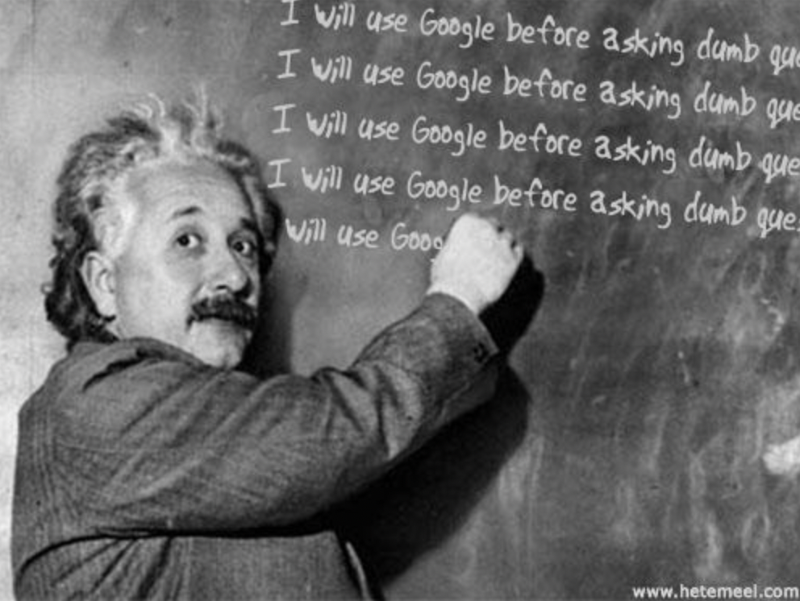

*"\[There is\] no such thing as a dumb question."*

I am sure many of us have heard this phrase before. Perhaps in elementary school when a teacher want to help students develop their cognitive skills. Or perhaps in a Physics class in high school when a teacher do not want students to feel intimidated by the advanced topic. Asking questions have been an important tradition in our education and every student should be encouraged to ask questions. However, I believe this phrase can sometimes be misinterpreted, that is, the word "dumb" is extremely versatile. Carl Sagan, an astrophysicist who popularized this quote, states that there is no such thing as a dumb question because "every question is a cry to understand the world." However, he acknowledges that there are "naïve questions, tedious questions, ill-phrased questions, [and] questions put after inadequate self-criticism"; questions that perhaps a revered software developer, Eric Raymond, would call "stupid questions," or put it more nicely, not-so-smart questions.

## A smart question

In an essay *How to Ask Questions the Smart Way*, Raymond establishes precepts that should be followed by software developers, or "newbies," on online forums, such as Stack Overflow, to devise an effective question that is more likely to get answered. First, Raymond encourages software developers to search their question thoroughly on the Web, and even ask a skilled friend for an advice. He suggests to use tactics like doing a Google search of an error message that they have encountered, as often times other software developers may have encountered the same error message and a similar question might have been asked. Raymond also introduces techniques such as posting on a site that is most on topic, adding tags that are related to their question, as well as using meaningful and specific subject header that attract qualified experts. And lastly, he encourages to write in clear, grammatical, and correctly-spelled language, and be courteous when provided with an answer.

## An example of a smart question

To demonstrate some of those techniques, here is an [example](https://stackoverflow.com/questions/75253140/cannot-retrieve-current-state-inside-async-function-in-react-js) of a Stack Overflow post by a relatively new user that asks the question the smart way. The user starts the question with the subject header "Cannot retrieve current state inside async function in React.js"; the header clearly states that the user is having an issue with an async function in React.js. The user also includes appropriate tags, such as "javascript" and "reactjs," which  makes it more likely for experts in JavaScript and React.js to find the question. The user then explains every steps that have been attempted and gives detailed explanation of what the issue is. The user then embeds the code in the question and finishes the question by thanking the community in advance. The question receives an answer within 20 minutes of posting which solved the user's issue. 

To demonstrate the not-so-smart question, here is another [example](https://stackoverflow.com/questions/75253171/download-file-from-aws-s3-bucket-to-local-using-s3-getobject) from the Stack Overflow. The user starts the question with the subject header "Download File from AWS s3 Bucket to Local using s3.getObject"; it does not clearly state what the issue is and only state what the user is attempting to do. The user then embeds the code and provide a single sentence of what the code is attempting to do. The question received a downvote and did not receive any answers.

As demonstrated in the above examples, asking smart questions can greatly increase the chance of getting an answer promptly from a qualified expert. By following the techniques provided by Raymond, that is, by searching the Web prior to asking questions and by asking well formulated, courteous, and sincere questions, software engineers will be able to communicate effectively to solve difficult problems through the help of a community.
